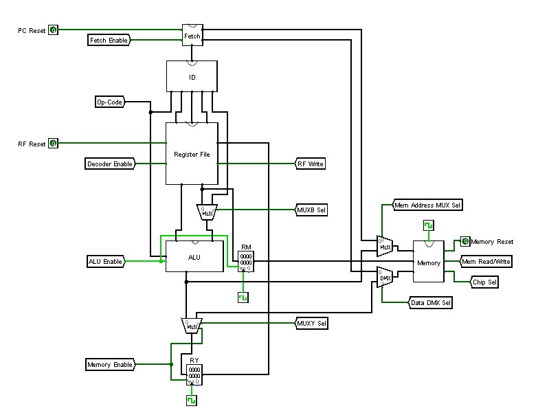
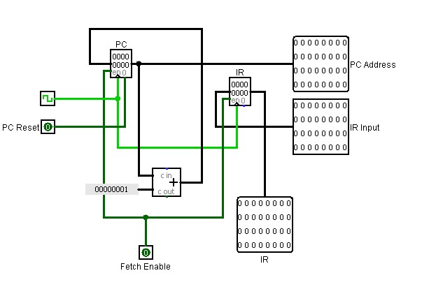
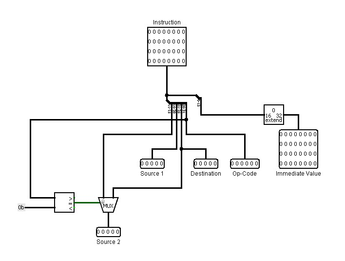
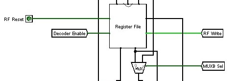
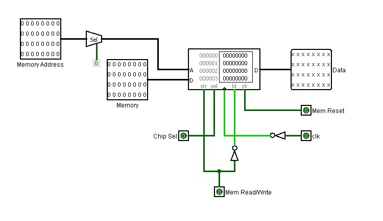
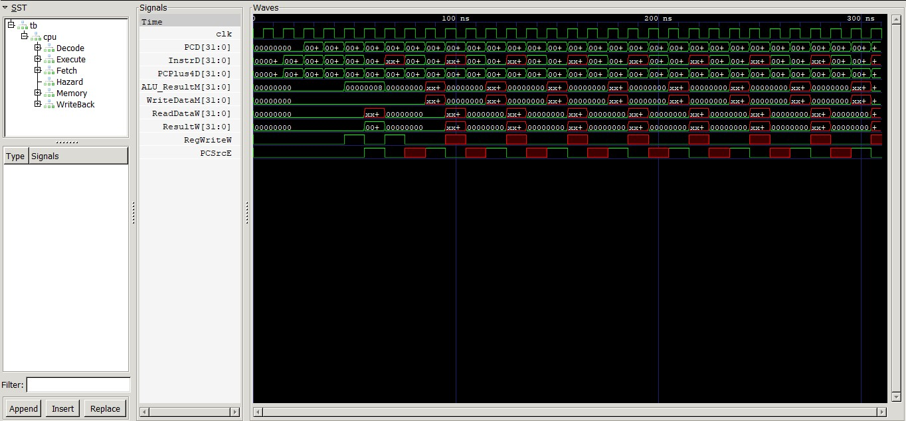

# 5-Stage Pipelined MIPS Processor with Hazard Handling

  
*Complete 5-Stage MIPS Pipeline Datapath with Control Signals and Data Paths*

This repository contains a fully functional **5-stage pipelined MIPS processor** implemented in synthesizable Verilog HDL. It features advanced hazard resolution techniques:

- **Operand forwarding** (from EX/MEM and MEM/WB) for data hazards  
- **Early branch evaluation** in the EX stage + static "predict-not-taken" for control hazards  

The processor supports a practical subset of the MIPS ISA:

- **R-type**: ADD, SUB, AND, OR, XOR  
- **I-type**: ADDI, ANDI, LW, SW  
- **Branch**: BEQ  

The design achieves **zero stalls** for data hazards in the provided test program and demonstrates a CPI of **2.0** for short sequences (4 instructions) due to pipeline fill overhead, approaching the ideal **1.0** CPI for longer programs.

---

## Project Objectives and Scope

- Implement a classic 5-stage pipeline (IF → ID → EX → MEM → WB) with inter-stage registers  
- Resolve RAW data hazards using comprehensive forwarding (no stalls in test cases)  
- Handle control hazards with EX-stage branch resolution and a 2-cycle misprediction penalty  
- Support essential MIPS instructions including arithmetic, logic, memory, and branching  
- Verify functionality and performance via Icarus Verilog + GTKWave simulation  
- Demonstrate modular, synthesizable Verilog suitable for FPGA/ASIC implementation  

**Limitations**: No dynamic branch prediction, no full MIPS ISA (e.g., no jumps, floating-point, or exceptions), load-use hazards require stall logic (implemented but not triggered in test program).

---

## System Architecture

### Pipeline Stages

1. **Instruction Fetch (IF)**  
   PC → Instruction Memory → Fetch 32-bit instruction → Compute PC+4  
   

2. **Instruction Decode (ID)**  
   Decode opcode/funct → Generate control signals → Read rs/rt from Register File → Sign-extend immediate  
   

3. **Execute (EX)**  
   ALU operation → Address generation → Operand forwarding muxes → Branch condition & target evaluation  
   

4. **Memory Access (MEM)**  
   Load/Store using calculated address → Data Memory read/write  
   

5. **Write Back (WB)**  
   Mux selects ALU result or loaded data → Write to Register File (x0 hardwired to 0)

Pipeline registers (IF/ID, ID/EX, EX/MEM, MEM/WB) store over 100 bits each, isolating stages and preserving state.

### Hazard Handling

#### Data Hazards – Operand Forwarding
The **Hazard Unit** detects RAW dependencies and generates `ForwardAE`/`ForwardBE` (2-bit):
- `10`: Forward from EX/MEM (previous ALU result)
- `01`: Forward from MEM/WB (result about to be written back)
- `00`: Use value from ID/EX (register file read)

All data hazards in the test program are resolved **without stalls**.

#### Control Hazards – Branch Handling
- Branch decision made in **EX stage**
- Static **predict-not-taken** policy
- On taken branch → flush two instructions → 2-cycle penalty
- Test program’s BEQ is **not taken** → no penalty

---

## Logisim Prototyping

Before Verilog coding, the entire datapath was prototyped and validated in **Logisim**:
- Modular subcircuits for each stage and component
- Main circuit: `mips_pipeline.circ`
- Manual clock stepping to verify forwarding paths, branch logic, and memory operations

---

## Verilog Implementation

### Module Hierarchy

| Module Name          | File                    | Description                                      |
|----------------------|-------------------------|--------------------------------------------------|
| `pipeline_top`       | `pipeline_top.v`        | Top-level integration of all stages & memories   |
| `fetch_cycle`        | `fetch_cycle.v`         | IF stage + PC logic                              |
| `decode_cycle`       | `decode_cycle.v`        | ID stage, control decoder, sign-extend           |
| `execute_cycle`      | `execute_cycle.v`       | EX stage, ALU, forwarding, branch logic          |
| `memory_cycle`       | `memory_cycle.v`        | MEM stage, DMEM interface                        |
| `writeback_cycle`    | `writeback_cycle.v`     | WB mux and register write control                |
| `hazard_unit`        | `hazard_unit.v`         | Forwarding control signal generation             |
| `ALU`                | `ALU.v`                 | 16 operations (ADD, SUB, AND, OR, SLT, shifts…)  |
| `instruction_memory` | `instruction_memory.v`  | 64-entry ROM (PC[7:2] addressing)                |
| `data_memory`        | `data_memory.v`         | Synchronous RAM, byte-addressable                |
| `register_file`      | `register_file.v`       | 32 × 32-bit registers, async read, sync write    |

### Key Code Snippet – Hazard Unit (Simplified)

```verilog
module hazard_unit(
    input rst, RegWriteM, RegWriteW,
    input [4:0] RD_M, RD_W, Rs1_E, Rs2_E,
    output reg [1:0] ForwardAE, ForwardBE
);
    always @(*) begin
        ForwardAE = 2'b00; ForwardBE = 2'b00;

        if (RegWriteM && (RD_M != 5'h00) && (RD_M == Rs1_E)) ForwardAE = 2'b10;
        else if (RegWriteW && (RD_W != 5'h00) && (RD_W == Rs1_E)) ForwardAE = 2'b01;

        if (RegWriteM && (RD_M != 5'h00) && (RD_M == Rs2_E)) ForwardBE = 2'b10;
        else if (RegWriteW && (RD_W != 5'h00) && (RD_W == Rs2_E)) ForwardBE = 2'b01;
    end
endmodule
```

### Test Program (`memfile.hex`)

```asm
0062E233    // add $t0, $t1, $t2          ($t0 = 5 + A = F)
00A4A423    // sw  $t0, 0($t2)            (Mem[A] = F)   → EX/MEM forward
00832303    // lw  $t1, 0($t1)            (load from Mem[5])
00008063    // beq $t0, $t1, +8           (F != loaded value → not taken)
```

Exercises both forwarding paths and branch logic.

---

## Simulation and Verification

### Tools
- **Icarus Verilog** – compilation & simulation
- **GTKWave** – waveform viewing

### Build & Run (`build.sh`)

```bash
#!/bin/bash
iverilog -g2012 -o pipeline_sim src/*.v sim/testbench.v
vvp pipeline_sim
gtkwave sim/pipeline.vcd waves.gtkw
```

### Key Waveform


**Observations**:
- 8 clock cycles for 4 instructions → CPI = 2.0
- Correct forwarding: `WriteDataM` = 0xF from ADD
- `PCSrcE` = 0 (branch not taken)
- Final register write: `$t0` = 0xF

### Execution Timeline

| Instruction | CC1 | CC2 | CC3 | CC4 | CC5 | CC6 | CC7 | CC8 |
|-------------|-----|-----|-----|-----|-----|-----|-----|-----|
| add         | IF  | ID  | EX  | MEM | WB  |     |     |     |
| sw          |     | IF  | ID  | EX  | MEM | WB  |     |     |
| lw          |     |     | IF  | ID  | EX  | MEM | WB  |     |
| beq         |     |     |     | IF  | ID  | EX  | MEM | WB  |

Perfect overlap after pipeline fill → **no stalls**

---

## Performance Analysis

For a program with **N** instructions and no hazards:

\[
\text{Total Cycles} = N + 4 \quad \Rightarrow \quad \text{CPI} = \frac{N + 4}{N}
\]

| N     | Total Cycles | CPI   | Efficiency       |
|-------|--------------|-------|------------------|
| 4     | 8            | 2.00  | 50%              |
| 10    | 14           | 1.40  | 71.4%            |
| 100   | 104          | 1.04  | ~96.2%           |

Confirms that pipeline overhead becomes negligible for longer programs.

---

## Repository Structure

```
├── src/                  → All Verilog modules
├── sim/                  → testbench.v, memfile.hex, build.sh, waves.gtkw
├── logisim/              → Logisim prototype (.circ files)
├── docs/                 → Full project report (report.pdf) + images
├── .gitignore
└── README.md             → This file
```

Just clone and run `./sim/build.sh` to simulate instantly!

---

Main references:
- Patterson & Hennessy – *Computer Organization and Design: The Hardware/Software Interface* (MIPS Edition)
- Official MIPS Instruction Set documentation

Tools used: Logisim-Evolution, Icarus Verilog, GTKWave
